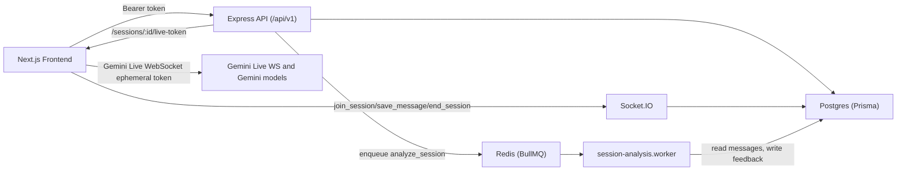
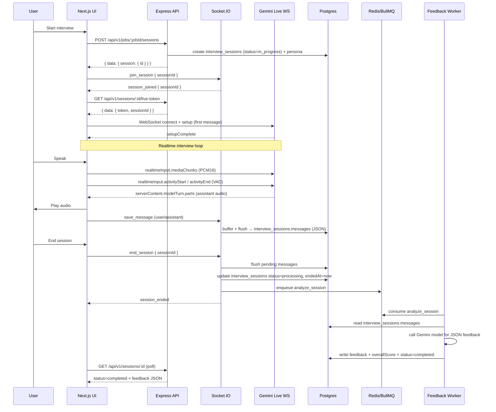

# AscendAI — Realtime Interview Practice


AscendAI is a full‑stack app for practicing interview sessions with a realtime, voice‑based AI interviewer (STT + TTS) using Gemini Live. Sessions are saved to the database and a background worker generates structured feedback after the interview ends.

## Monorepo Layout

- `backend/` — Express API + Socket.IO + BullMQ worker (Prisma/Postgres)
- `frontend/` — Next.js App Router UI (React Query + Socket.IO client)

## Key Features

- **Jobs**: create and view jobs (title/company/description)
- **Practice sessions**: start technical/background/culture sessions per job
- **Realtime voice interview**:
  - mic audio → Gemini Live
  - AI audio streamed back and played in the browser
  - conversation persisted to `interview_sessions.messages` (JSON)
- **Feedback generation** (async):
  - session ends → status becomes `processing`
  - BullMQ worker generates JSON feedback (overall score + strengths/weaknesses/recommendations/summary)
  - status becomes `completed`

## Tech Stack

**Frontend**

- Next.js (App Router), React, TypeScript
- TanStack React Query
- Socket.IO client
- Web Audio API (AudioWorklet)
- Supabase Auth (client-side)

**Backend**

- Express, TypeScript
- Prisma (Postgres)
- Socket.IO server
- BullMQ + Redis (Upstash supported)
- Supabase Admin Auth verification
- Gemini (`@google/genai`)

## Architecture (High Level)



## Interview Session Sequence (End-to-End)

This is the most important runtime flow for the app.



## Data Model (Important Bits)

Prisma schema lives at `backend/prisma/schema.prisma`. The main tables:

- `jobs`
- `personas` (generated interviewer persona per job+scenario)
- `interview_sessions`
  - `status`: `in_progress` → `processing` → `completed`
  - `messages` (JSON): array of `{ role: "user"|"assistant", content: string, createdAt: string }`
  - `feedback` (JSON): `{ overallScore, strengths[], weaknesses[], recommendations[], summary, ... }`

## API + Socket Contract

### REST API (Backend)

Base URL: `http://localhost:<PORT>/api/v1`

- `GET /jobs` — list jobs for current user
- `POST /jobs` — create a job
- `GET /jobs/:id` — job details
- `GET /jobs/:jobId/sessions` — list sessions for job
- `POST /jobs/:jobId/sessions` — create session (creates/reuses persona)
- `GET /sessions/:id` — session details including `status`, `overallScore`, `feedback`
- `POST /sessions/:id/end` — end session (sets `processing`, enqueues feedback job)
- `GET /sessions/:id/live-token` — returns `{ token, sessionId }` for Gemini Live WS

All routes require:

```http
Authorization: Bearer <supabase_access_token>
```

#### Request/Response Examples

##### Create a session

```http
POST /api/v1/jobs/<jobId>/sessions
Content-Type: application/json
Authorization: Bearer <token>

{ "scenarioType": "technical" }
```

Response:

```json
{
  "data": {
    "session": {
      "id": "uuid",
      "scenarioType": "technical",
      "status": "in_progress"
    }
  }
}
```

##### End a session

```http
POST /api/v1/sessions/<sessionId>/end
Authorization: Bearer <token>
```

Response:

```json
{ "data": { "id": "<sessionId>", "status": "processing" } }
```

##### Fetch session feedback/status

```http
GET /api/v1/sessions/<sessionId>
Authorization: Bearer <token>
```

Response (when complete):

```json
{
  "data": {
    "id": "uuid",
    "status": "completed",
    "overallScore": 75,
    "feedback": {
      "overallScore": 75,
      "strengths": ["Clear communication", "Good technical knowledge"],
      "weaknesses": ["Could improve on system design details"],
      "recommendations": ["Practice whiteboard coding exercises"],
      "summary": "Overall strong performance with room for improvement."
    }
  }
}
```

#### Error Codes (Common)

- `401 Unauthorized` — missing/invalid Supabase bearer token
- `404 Not found` — invalid UUID or resource not owned by user
- `400 Bad request` — invalid payload (e.g. scenarioType)
- `500 Internal Server Error` — unexpected backend error

### Socket.IO Events (Backend)

Namespace: default (`io`), room = `sessionId`

- Client → Server:
  - `join_session` `{ sessionId }`
  - `save_message` `{ sessionId, role, content }`
  - `end_session` `{ sessionId }`
  - `leave_session` `sessionId`
- Server → Client:
  - `session_joined` `{ sessionId }`
  - `session_ended` `{ sessionId }`

The backend buffers `save_message` events and periodically flushes them into `interview_sessions.messages` to avoid excessive DB writes.

## Deep Dive: Real-time Audio Pipeline (Low Latency)

Achieving "life-like" latency in a voice-based AI interview is critical. AscendAI uses a specialized pipeline to minimize the Round Trip Time (RTT) between user speech and AI response.

### 1. AudioWorklet (The Secret Sauce)
Traditional `ScriptProcessorNode` runs on the browser's main thread, making it prone to "jank" when the UI renders. We use an **AudioWorklet**, which runs on a dedicated high-priority audio thread.
- **Source**: `frontend/public/gemini-audio-processor.worklet.js`
- **Benefit**: Zero-latency capture even when the React components are re-rendering.

### 2. Strategic Chunking & Encoding
To balance network overhead and latency, we don't send individual audio samples. Instead, we chunk audio into **40ms frames** (`CHUNK_SAMPLES = 640` @ 16kHz). 
- **Encoding**: Audio is captured as Float32 and converted to **PCM 16-bit** (signed) before being base64 encoded.
- **Service**: `frontend/src/features/session/services/audio.service.ts`

### 3. Voice Activity Detection (VAD)
We implement a high-performance VAD within the AudioWorklet to detect speech starts/stops instantly.
- When speech is detected, we send a `realtimeInput.activityStart`.
- When silence is detected for `SILENCE_DURATION_MS`, we send `realtimeInput.activityEnd`.
- This tells Gemini Live to stop listening and start processing immediately, shaving off valuable milliseconds compared to server-side silence detection.

---

## Deep Dive: Socket.IO Message Persistence Strategy

Handling high-frequency message streams (transcripts) during a live session can overwhelm a standard database if every update is a direct `UPDATE` query.

### In-Memory Buffering (0.8s Flush)
The backend employs a "buffering & flushing" strategy to protect PostgreSQL:
1. **Queueing**: Every `save_message` event from the client is pushed into an in-memory `Map` (keyed by `sessionId`).
2. **Debounced Flush**: A timer is set for **800ms**. If new messages arrive within this window, they are appended to the buffer and the timer resets.
3. **Atomic Commit**: After 800ms of inactivity, the entire buffer is merged with the existing `interview_sessions.messages` JSONB array in a single database transaction.

### Safety Hooks
- **End Session**: A manual session end triggers an immediate synchronous flush of all pending messages.
- **Auto-Flush on Disconnect**: If a user's socket disconnects, the server waits **5 seconds** (grace period for reconnection). If the session remains empty, it flushes all messages and auto-sets the status to `processing`.

---

## Local Development

### Prerequisites

- Node.js 18+ (recommended: 20+)
- Postgres (or Supabase Postgres)
- Redis (Upstash or local Redis) for BullMQ
- Gemini API key

### 1) Configure Environment Variables

Create env files (examples below). Do **not** commit secrets.

#### Backend (`backend/.env`)

See `backend/src/config/env.ts` for the authoritative list.

Example:

```bash
NODE_ENV=development
PORT=8000
FRONTEND_URL=http://localhost:3000

SUPABASE_URL=...
SUPABASE_SERVICE_ROLE_KEY=...

DATABASE_URL=postgresql://...
REDIS_URL=rediss://...

GEMINI_API_KEY=...
GEMINI_MODEL=gemini-2.5-flash
GEMINI_LIVE_MODEL=gemini-2.5-flash-native-audio-preview-12-2025
GEMINI_API_VERSION=v1beta
SENTRY_DSN=
```

#### Frontend (`frontend/.env`)

Used by the Next.js client.

```bash
NEXT_PUBLIC_API_BASE_URL=http://localhost:8000/api/v1
NEXT_PUBLIC_SOCKET_URL=http://localhost:8000

NEXT_PUBLIC_SUPABASE_URL=...
NEXT_PUBLIC_SUPABASE_ANON_KEY=...

# If you use Google auth in Supabase:
NEXT_PUBLIC_GOOGLE_CLIENT_ID=...
NEXT_PUBLIC_GOOGLE_CLIENT_SECERT=...
```

### 2) Install & Initialize
```bash
# Backend
cd backend && npm install
npx prisma generate
npx prisma migrate dev  # Sync database schema

# Frontend
cd ../frontend && npm install
```

### 3) Start Services
```bash
# Backend & Worker
cd backend
npm run dev

# Frontend
cd ../frontend
npm run dev
```

## Quality Assurance & Testing

We maintain high system reliability through comprehensive automated testing.

### End-to-End (E2E) Tests
We use **Playwright** to test critical paths like authentication, job creation, and session management.
```bash
# Run all E2E tests
cd frontend
npm run test:e2e
```

### Database Integrity
Always ensure your Prisma client is hydrated after schema changes:
```bash
cd backend
npx prisma generate
```

## Realtime Interview Session (How it Works)

### 1) Session creation

Frontend calls `POST /jobs/:jobId/sessions` → backend creates an `interview_sessions` row (`status=in_progress`) and ensures a persona exists.

### 2) Socket join + message persistence

Frontend joins the session room via `join_session`.

During the interview, the frontend emits `save_message` events. The backend:

- buffers them (in memory) and flushes to `interview_sessions.messages` (JSON)
- flushes again on `end_session` to ensure the full conversation is persisted

### 3) Gemini Live (voice)

Frontend requests an ephemeral token:

- `GET /api/v1/sessions/:id/live-token`

Then connects to Gemini Live via WebSocket and sends a `setup` message as the **first** message.

### 4) Low latency audio pipeline

Low latency comes from:

- **AudioWorklet** (instead of `ScriptProcessorNode`) so audio processing is off the main thread
- **chunking** mic audio to reduce WS send frequency
- **VAD** to send `activityStart` / `activityEnd` promptly for fast turn-taking
- optimized base64 conversion for PCM16

Key files:

- Audio worklet: `frontend/public/gemini-audio-processor.worklet.js`
- Mic streaming: `frontend/src/features/session/hooks/useGeminiMic.ts`
- Session WS + playback + transcripts: `frontend/src/features/session/hooks/useGeminiSession.ts`
- Encoding helpers: `frontend/src/features/session/services/audio.service.ts`

## Feedback Generation (Worker)

When a session ends:

- backend sets `status=processing`
- enqueues a BullMQ job `analyze_session` on the `session-analysis` queue

Worker file:

- `backend/src/queues/workers/session-analysis.worker.ts`

Worker logic:

- reads `interview_sessions.messages`
- builds a prompt using `backend/src/services/ai/prompts/feedback.prompt.ts`
- calls Gemini model with `responseMimeType: "application/json"`
- saves `feedback` + `overallScore`
- sets `status=completed`

Frontend updates:

- the job sessions page polls while any session is `processing`
- the feedback dialog polls `GET /sessions/:id` until `status=completed`

## Frontend Pages & Key Components

- Jobs list: `frontend/src/app/jobs/page.tsx`
- Job detail + sessions: `frontend/src/app/jobs/[id]/page.tsx`
  - sessions list/grid: `frontend/src/features/jobs/components/JobSessions/*`
  - feedback dialog: `frontend/src/features/session/components/FeedbackDialog.tsx`
- Interview session: `frontend/src/app/session/[id]/page.tsx`
  - client UI: `frontend/src/features/session/components/InterviewSessionClient.tsx`
  - orchestration: `frontend/src/features/session/hooks/useInterviewSession.ts`

## Backend Modules (Where Things Live)

- Server bootstrap: `backend/src/index.ts`
- Express server: `backend/src/server.ts`
- Routes:
  - Jobs: `backend/src/routes/job/*`
  - Sessions: `backend/src/routes/sessions/*`
- Socket.IO:
  - Server init: `backend/src/socket.ts`
  - Session handler: `backend/src/socket/session.handler.ts`
- Worker:
  - Queue: `backend/src/queues/session-analysis-queue.ts`
  - Worker: `backend/src/queues/workers/session-analysis.worker.ts`

## Troubleshooting

### "Failed to enqueue analysis job" / "Connection is closed"

This means BullMQ could not enqueue the job because Redis is unavailable.

Checklist:

- `REDIS_URL` is correct and reachable from your machine
- DNS/network allows your Upstash host (or local redis is running)
- backend logs show `Redis connected` and not repeated reconnect/end

### Prisma error: `Argument openessLevel is missing`

Your runtime Prisma Client is out of sync with the schema. Regenerate:

```bash
cd backend
npx prisma generate
```

### Gemini Live errors

- `setup must be the first message` → ensure nothing is sent before `setup`
- `Unknown name "languageCodes"` → remove unsupported fields from `setup.inputAudioTranscription`

### Feedback generated but UI not updating

- The job sessions page refetches while any session is `processing`.
- The feedback dialog polls `GET /sessions/:id` until `status=completed`.
- If you see `processing` forever:
  - check Redis connectivity (BullMQ enqueue must succeed)
  - check worker logs (`Session analysis complete`)

## Build / Production Notes

- Backend: `cd backend && npm run build && npm start`
- Frontend: `cd frontend && npm run build && npm start`
- Ensure `FRONTEND_URL`, `NEXT_PUBLIC_API_BASE_URL`, and `NEXT_PUBLIC_SOCKET_URL` match your deployment URLs.
